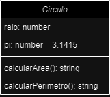
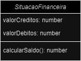

# Atividade Extra 01

01. Uma classe é a abstração de um conceito que contém atributos, que são as caracteristas de uma classe, e metodos, que são as ações que o objeto terá. Já o objeto é  uma intância concreta e individual da classe, que possui atributos e métodos definidos na classe. Um exemplo de classe poderia ser "Contrução" onde os atributos podem ser "Codigo ID", "Andares", "Área Total", "Função Social", e "Endereço" e os metodos poderiam ser "Calcular IPTU".
~~~typescript
//classe
class Contrucao  {
    codigo: string;
    andares: number;
    areaTotal: number;
    funcaoSocial: string;
    endereco: string

contructor(codigo: string, andares: number, areaTotal: number, funcaoSocial: sting, endereco: string) {
        this.codigo = codigo;
        this.andares = andares;
        this.areaTotal = areaTotal;
        this.funcaoSocial = funcaoSocial;
        this.endereco = endereco;
    }
    calcularIPTU() {
        let totalIPTU = this.areaTotal * 0.1
        console.log("Total IPTU: {totalIPTU.toFixed(2)})
    }
}

//Objeto
const casa = new Contrucao("RES012345", 1, 150.00, "MORADIA", "Rua de trás, 123")

casa.calcularIPTU()
~~~
---
02. Atributos são as caracteristicas ou propiedades de um objeto, são como adjetivos que descrevem o elemento. Já os metodos são as ações ou comportamentos queum objeto pode realizar, definindo o que o objeto pode fazer. Como exemplo de atributo podemos citar a aréa total do objeto casa, que tem o valor de 150 m². Já um como método podemos citar o calculo do IPTU, que retorna uma string com o valor total calculado.

---
03. 

| Atributo| Sistema em que não é importante | Sistema em que é moderadamente importante| Sistema em que é essecial|
|:---|:---:|:---:|:---:|
| CPF | monitor de saturação saguinea| Aplicativo de academia|Todos que precisem utilizar dados unicos de uma pessoa fisica, podendo ser até a chave principal em um cadastro|
Historico de saúde | Sistema de compras de um mercado | Sistema de avaliação física | Sistema médico|
| Quatidade de seguidores | Sistema médico | Perfil de jogos online | Redes sociais |
| Habilidade destra | Sistema bancário | Sistema escolar | Sistema de um editor de texto para escrit a a mão|
| Endereço | Sistema de monitoramento cardiaco | Sistem de cadastro de um hospital | Sistema de entregas |
| Saldo em conta | Redes Sociais | Sistema de jogos online | Sistema bancário |
| Etinia | Sistema de entrada e saida | Sistema IBGE | Sistema de cotas |

---
04. 
a)  Depende. As regra de negócio vão dizer se uma pessoa poderá possuir mais de uma conta e se uma conta possuirá mais de um titular, como conta conjunta. Dependendo das regras de negócio uma implemnteção pode ser mais interessante do que outra.

b) No caso das regras permitirem mais de uma conta para cada usuário a estritura  mais adequada seria uma lista de contas.

---

05. Instituição: Representa a universidade ou faculdade.
Departamento: Representa uma área específica de conhecimento.
Biblioteca: Controla o acervo de livros e materiais didáticos.
Matrícula: Representa a inscrição de um aluno em uma disciplina.
Nota: Representa a avaliação de um aluno em uma atividade

---

06.  Jogo de futebol. Atributos: Duração, local, serie, time1, time2, placarTime1, placarTime2, rodada, capeonato. Metodos: Penalti, falta, iniciarPartida.

---

07. 
~~~typescript
class Retangulo {
    l1: number = 0;
    l2: number = 0;
    
    calcularArea(): number {
        return this.l1 * this.l2;
    }
    calcularPerimetro(): string {
        return `Perimetro: ${(2 * this.l1) + (2 * this.l2)} Cm.`
    }

constructor(l1: number, l2:number) {
    this.l1 = l1;
    this.l2 = l2;
}

}

let retangulo1 =  new Retangulo(5, 10)
console.log(retangulo1.calcularPerimetro())

~~~
---

08. 
~~~typescript
class Circulo {
    raio: number;
    pi: number = 3.1415

    calculaArea(): string{
        return `Area: ${(this.pi * this.raio ** 2).toFixed(1)} m²`

    }

    calculaPerimetro(): string {
        return `Perimetro: ${(2 * this.pi * this.raio).toFixed(1)} m`
    }

constructor(raio:number) {
    this.raio = raio
}

let circulo1 =  new Circulo(5)
console.log(circulo1.calculaArea())
console.log(circulo1.calculaPerimetro())

}
~~~
---

09. 
~~~typescript
class SituacaoFinanceira {
    valorCreditos: number;
    valorDebitos: number;

    calcularSaldo(): string {
        return `Saldo R$ ${(this.valorCreditos - this.valorDebitos).toFixed(2)}`
    }
constructor(valorCreditos: number, valorDebitos: number){
    this.valorCreditos = valorCreditos;
    this.valorDebitos = valorDebitos;
}

}

let situacaoFinanceira1 = new SituacaoFinanceira(5550.29, 2125.00)
console.log(situacaoFinanceira1.calcularSaldo())
~~~

---

10. 

